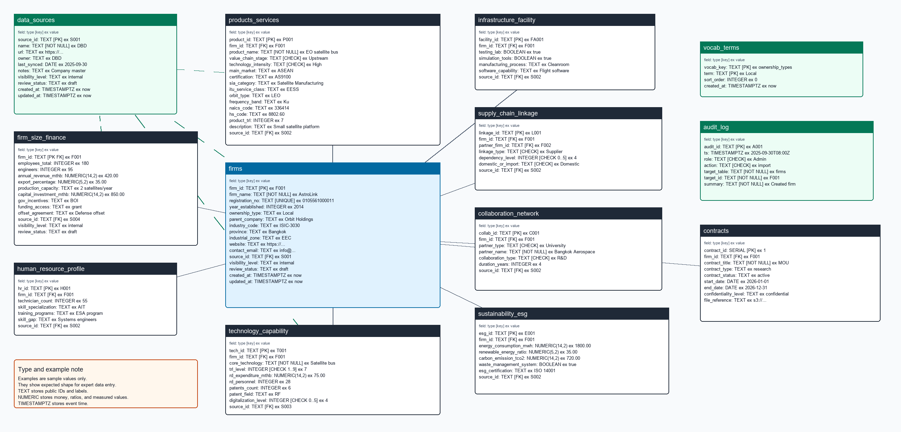

# Satellite Database Schema

## 1. Purpose

This document explains the PostgreSQL v2 schema used by the current API and frontend.

Schema file:

```text
database/schema.sql
```

The schema uses `firms` as the anchor table. Domain tables link back to `firms` through `firm_id`.

## 2. Diagram



Editable source:

```text
docs/system/diagrams/database-v2.drawio
```

dbdiagram.io sources:

```text
docs/system/diagrams/database-v2-dbdiagram.dbml
docs/system/diagrams/database-v2-dbdiagram.sql
```

Use the DBML file for the best dbdiagram.io result. Use the SQL file when you want to test SQL import.

## 3. Table Summary

| Table | Purpose | Primary key | Links |
| --- | --- | --- | --- |
| firms | Anchor table for satellite industry organizations. | firm_id | source_id -> data_sources.source_id |
| firm_size_finance | Current firm size, revenue, capacity, investment, incentives, and funding profile. | firm_id | firm_id -> firms.firm_id, source_id -> data_sources.source_id |
| products_services | Product and service portfolio with satellite taxonomy fields. | product_id | firm_id -> firms.firm_id, source_id -> data_sources.source_id |
| technology_capability | Firm technology, TRL, R&D, patent, and digitalization capability rows. | tech_id | firm_id -> firms.firm_id, source_id -> data_sources.source_id |
| infrastructure_facility | Facilities, testing, simulation, manufacturing, and software capability. | facility_id | firm_id -> firms.firm_id, source_id -> data_sources.source_id |
| human_resource_profile | Technical workforce profile and skill gap data. | hr_id | firm_id -> firms.firm_id, source_id -> data_sources.source_id |
| supply_chain_linkage | Directed firm to firm supply chain and ecosystem edges. | linkage_id | firm_id -> firms.firm_id, partner_firm_id -> firms.firm_id, source_id -> data_sources.source_id |
| collaboration_network | Collaboration rows between firms and institutions. | collab_id | firm_id -> firms.firm_id, source_id -> data_sources.source_id |
| sustainability_esg | Energy, emissions, waste, and ESG certification profile. | esg_id | firm_id -> firms.firm_id, source_id -> data_sources.source_id |
| data_sources | Source registry for provenance and evidence. | source_id | Referenced by firm and domain tables. |
| vocab_terms | Controlled vocabulary terms for frontend dropdowns. | vocab_key, term | No foreign key. |
| audit_log | Action history for governance and review evidence. | audit_id | Logical link through target_table and target_id. |
| contracts | Retained prototype contract metadata support. | contract_id | firm_id -> firms.firm_id |

## 4. Table Details

### 4.1. firms

| Item | Value |
| --- | --- |
| Purpose | Anchor table for satellite industry organizations. |
| Primary key | firm_id |
| Important fields | firm_name, registration_no, year_established, ownership_type, province, website, contact_email |
| Relationships | source_id -> data_sources.source_id |
| Constraints | Registration number is unique when present. Year range is 1800 to 2100. Ownership type uses Local, Foreign, or JV. |
| Indexes | registration_no, lower firm_name, province, source_id |

### 4.2. firm_size_finance

| Item | Value |
| --- | --- |
| Purpose | Current firm size, revenue, capacity, investment, incentives, and funding profile. |
| Primary key | firm_id |
| Important fields | employees_total, engineers, annual_revenue_mthb, export_percentage, production_capacity, capital_investment_mthb |
| Relationships | firm_id -> firms.firm_id, source_id -> data_sources.source_id |
| Constraints | Counts and money values are non-negative. Export percentage is 0 to 100. |
| Indexes | Primary key supports firm lookup. |

### 4.3. products_services

| Item | Value |
| --- | --- |
| Purpose | Product and service portfolio with satellite taxonomy fields. |
| Primary key | product_id |
| Important fields | product_name, value_chain_stage, technology_intensity, main_market, certification, sia_category, itu_service_class, orbit_type, frequency_band, naics_code, hs_code, product_trl |
| Relationships | firm_id -> firms.firm_id, source_id -> data_sources.source_id |
| Constraints | Value chain stage uses Upstream, Midstream, or Downstream. Product TRL is 1 to 9 when present. |
| Indexes | firm_id, value_chain_stage plus technology_intensity, sia_category |

### 4.4. technology_capability

| Item | Value |
| --- | --- |
| Purpose | Firm technology, TRL, R&D, patent, and digitalization capability rows. |
| Primary key | tech_id |
| Important fields | core_technology, trl_level, rd_expenditure_mthb, rd_personnel, patents_count, patent_field, digitalization_level |
| Relationships | firm_id -> firms.firm_id, source_id -> data_sources.source_id |
| Constraints | TRL is 1 to 9. Digitalization level is 0 to 5. Counts and money values are non-negative. |
| Indexes | firm_id, core_technology, trl_level |

### 4.5. infrastructure_facility

| Item | Value |
| --- | --- |
| Purpose | Facilities, testing, simulation, manufacturing, and software capability. |
| Primary key | facility_id |
| Important fields | testing_lab, simulation_tools, manufacturing_process, software_capability |
| Relationships | firm_id -> firms.firm_id, source_id -> data_sources.source_id |
| Constraints | Testing and simulation flags default to false. |
| Indexes | firm_id |

### 4.6. human_resource_profile

| Item | Value |
| --- | --- |
| Purpose | Technical workforce profile and skill gap data. |
| Primary key | hr_id |
| Important fields | technician_count, skill_specialization, training_programs, skill_gap |
| Relationships | firm_id -> firms.firm_id, source_id -> data_sources.source_id |
| Constraints | Technician count is non-negative. |
| Indexes | firm_id |

### 4.7. supply_chain_linkage

| Item | Value |
| --- | --- |
| Purpose | Directed firm to firm supply chain and ecosystem edges. |
| Primary key | linkage_id |
| Important fields | linkage_type, dependency_level, domestic_or_import |
| Relationships | firm_id -> firms.firm_id, partner_firm_id -> firms.firm_id, source_id -> data_sources.source_id |
| Constraints | A firm cannot link to itself. Dependency level is 0 to 5. Linkage type uses Supplier, Buyer, or Partner. |
| Indexes | unique firm_id plus partner_firm_id plus linkage_type, firm_id, partner_firm_id |

### 4.8. collaboration_network

| Item | Value |
| --- | --- |
| Purpose | Collaboration rows between firms and institutions. |
| Primary key | collab_id |
| Important fields | partner_type, partner_name, collaboration_type, duration_years |
| Relationships | firm_id -> firms.firm_id, source_id -> data_sources.source_id |
| Constraints | Partner type uses University, PRI, or Association. Collaboration type uses R&D, Training, or Testing. |
| Indexes | firm_id, partner_type |

### 4.9. sustainability_esg

| Item | Value |
| --- | --- |
| Purpose | Energy, emissions, waste, and ESG certification profile. |
| Primary key | esg_id |
| Important fields | energy_consumption_mwh, renewable_energy_ratio, carbon_emission_tco2, waste_management_system, esg_certification |
| Relationships | firm_id -> firms.firm_id, source_id -> data_sources.source_id |
| Constraints | Energy and emissions are non-negative. Renewable energy ratio is 0 to 100. |
| Indexes | firm_id |

### 4.10. data_sources

| Item | Value |
| --- | --- |
| Purpose | Source registry for provenance and evidence. |
| Primary key | source_id |
| Important fields | name, url, owner, last_synced, notes |
| Relationships | Referenced by firm and domain tables. |
| Constraints | Source name is required. Visibility and review status use controlled values. |
| Indexes | Primary key supports source lookup. |

### 4.11. vocab_terms

| Item | Value |
| --- | --- |
| Purpose | Controlled vocabulary terms for frontend dropdowns. |
| Primary key | vocab_key, term |
| Important fields | vocab_key, term, sort_order |
| Relationships | No foreign key. |
| Constraints | Each term is unique within a vocab key. |
| Indexes | Primary key supports vocab lookup. |

### 4.12. audit_log

| Item | Value |
| --- | --- |
| Purpose | Action history for governance and review evidence. |
| Primary key | audit_id |
| Important fields | ts, role, action, target_table, target_id, summary |
| Relationships | Logical link through target_table and target_id. |
| Constraints | Role and action use controlled values. |
| Indexes | ts descending, target_table plus target_id |

### 4.13. contracts

| Item | Value |
| --- | --- |
| Purpose | Retained prototype contract metadata support. |
| Primary key | contract_id |
| Important fields | contract_title, contract_type, contract_status, start_date, end_date, confidentiality_level, file_reference |
| Relationships | firm_id -> firms.firm_id |
| Constraints | Contract title is required in the API. Confidentiality defaults to confidential. |
| Indexes | Primary key supports contract lookup. |

## 5. Shared Metadata Fields

| Field | Purpose |
| --- | --- |
| source_id | Links records to the source registry where the table supports provenance. |
| visibility_level | Marks record exposure as public, internal, confidential, or restricted. |
| review_status | Marks workflow state as draft, pending_review, published, or retired. |
| created_at | Stores creation timestamp. |
| updated_at | Stores update timestamp through database triggers. |

## 6. Referential Behavior

| Relationship | Behavior |
| --- | --- |
| Firm to domain rows | Deleting a firm cascades to linked domain rows. |
| Source to records | Deleting a source sets source_id to null on linked records. |
| Supply chain linkages | Each linkage points from one firm to another firm. Self links are rejected. |
| Contracts | Deleting a firm cascades to linked contract metadata rows. |

## 7. Source References

| Source | URL |
| --- | --- |
| draw.io export formats | https://www.drawio.com/docs/manual/export/export-diagram/ |
| Amazon API Gateway HTTP APIs | https://docs.aws.amazon.com/apigateway/latest/developerguide/http-api.html |
| AWS Lambda with Amazon RDS | https://docs.aws.amazon.com/lambda/latest/dg/services-rds.html |
| AWS Lambda VPC access | https://docs.aws.amazon.com/lambda/latest/dg/configuration-vpc.html |
| Amazon VPC security groups | https://docs.aws.amazon.com/vpc/latest/userguide/creating-security-groups.html |
| Amazon RDS for PostgreSQL | https://docs.aws.amazon.com/AmazonRDS/latest/UserGuide/CHAP_PostgreSQL.html |
| Vercel environment variables | https://vercel.com/docs/environment-variables |
